# Vectorized Implementation of an Artificial Neural Network (ANN) and its application to a simple artificial dataset: Part 1
  
In this project we will go through the some of the details of implementing an Artificial Neural Network (ANN), including the derivation of the backpropagation algorithm and its vectorization for greater efficiency. Following that we will apply the ANN to an artificial dataset in order to try and understand how having hidden layers allows ANNs to classify datasets with complicated and nonlinear decision boundaries.

## Introduction to ANNs

Artificial Neural Networks are a computational model that have been inspired by biological neural networks in the brains of animals, humans included. In the past decade, many breakthroughs with ANNs have been made with respect to speech recognition, computer vision, text processing and many interesting applications. Here we will briefly describe ANNs before moving on to describe how they are optimised.

### Objectives of ANNs

Before we move into the details of what ANNs actually are and how they work, we will first clarify how they are applied. A major application of ANNs is in supervised learning, where one requires an algorithm that predicts an outcome based on a given set of data. More concretely, we are given a set of data $X$ we will call the "training data", and a set of targets $Y$. For example, $X$ can be a set of data consisting of handwritten digits, and $Y$ can be a set of numbers labelling the corresponding digit, with the objective being to devise an algorithm to classify a set of unseen handwritten digits according to the correct number. In other words, we want to find the function $f$ such that:

$$Y = f(X)$$

The supervised learning algorithm thus aims to produce a function $\hat{f}$ that is a good approximation of $f$, such that it produces an output $\hat{Y} = \hat{f}(X)$ that is "close" to the actual target $Y$, loosely speaking. Finding an appropriate function that minimizes the "distance" from the actual target is therefore an optimisation problem which will be elaborated upon later. This process is referred to as "training" the neural network on the training dataset that one provides. 

### A single Neuron

In biological neural networks, the neurons themselves are the basic unit of computation. Many neurons form connections with each other in other to form a network. The same principle applies to ANNs. The artificial neuron (which will be referred to as node) recieves input externally or from other neurons and applies a function on the inputs in order to produce an output.


| 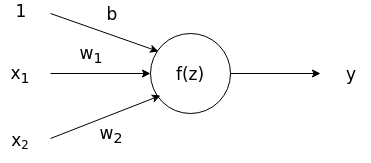 |
|----|
| Output: $$y = f(z) = f(x_{1}w_{1}+x_{2}w_{2}+b)$$ |

In most applications, a node will then take a linear combination of inputs $z = x_{1}w_{1}+x_{2}w_{2}+b$, including a bias term $b$, and apply a nonlinear activation function on the linear combination to produce an output as shown in the figure above. We can see that by tuning the weights $w_{1}$, $w_{2}$, we can adjust the output of the neuron.

There are many possible activation functions that are often used during implementation. The most common are:

* Sigmoid: $\sigma(z) = 1/(1+\mathrm{exp}(z))$ <br><br>
* tanh: $tanh(z) = 2\sigma(2z) -1$ <br><br>
* ReLU: $f(z) = \mathrm{max}(0,z)$ <br><br>

We do not go through the pros and cons of these activation functions here but will instead stick to the ReLU activation function, which stands for *Rectified Linear Unit*.

### The Feedforward Neural Network

By connecting many artifical neurons together, we can form a more complicated network that can approximate arbitrary continuous functions. Here we introduce the feedforward neural network, which was the original type of ANN devised by researchers in the field. It consists of many neurons connected in layers: 

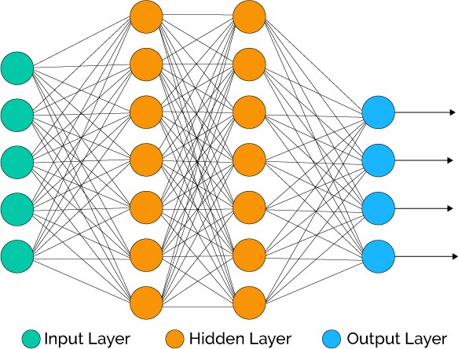

Information flows in one direction, from the left where the inputs are fed in to the right where the outputs are produced. The nodes the are present in between the input and output layers are known as hidden nodes in the hidden layer. One can have as many hidden layers as you like, but the computational complexity will naturally increase with the number of nodes and layers.

Most neural networks, including the one we will implement, are fully connected. That means that every node in one layers is connect to every single node in the next layer. 

We can now start to build our neural network in code and implement the feedforward or forward propagation process. We create the network as a class in python after making the necessary imports:


```python
import jdc
import numpy as np
import numpy.random as npr
import copy
import matplotlib.pyplot as plt
import types
from sklearn.datasets import make_gaussian_quantiles
from sklearn.preprocessing import OneHotEncoder


class Network(object):
    
    
    def __init__(self, sizes=[2,2,2]):
        """
        Initializes Neural Network with appropriate number of nodes
        and random small weights.
        
        Takes as input a list denoting the number of nodes in each layer.
        
        ie. [2,2,2] refers to a network with 2 input nodes, 2 hidden nodes
        and 2 output nodes.
        """
        self.depth = len(sizes) - 2
        self.sizes = sizes
        # here we add the biases to as the last column of the weight matrix
        self.w = [np.insert(npr.normal(0.,scale=(2/x)**0.5,size=(y,x)),
                    0,0,axis=1) for x, y in zip(sizes[:-1],sizes[1:])]
        self.a = []
        self.Delta = []
        self.Grad = []
```

The network is instantialized with several attributes: its depth, size in terms of the number of nodes in each layer, the initial weights chosen from a normal distribution with a certain variance (in this case based on the Glorot Initialization scheme which will not be covered), and several empty lists referring to the outputs or activations of every node in the network and values of the gradient. The input is assumed to be a data matrix with each row referring to a different feature, and each column referring to a different observation.

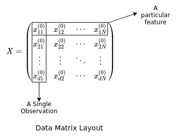

Now we would like to implement a method for data to be fed through the network to produce an output in a vectorized manner, that is, using matrix multiplication rather than individually calculating the output of every node from its inputs. To do this we can examine a single layer of neurons:

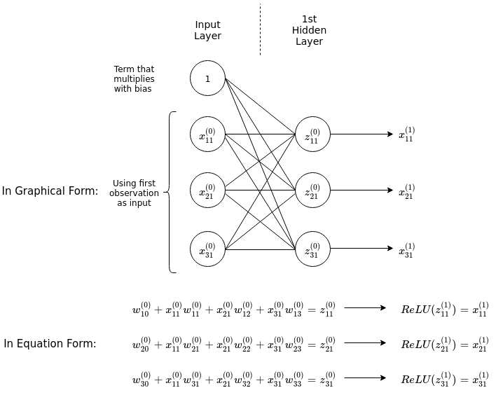

The diagram above shows explicitly the process of feeding an input with three features into a hidden layer with three nodes, fully connected with the input nodes. The inputs are multiplied by their corresponding weights connecting them to a node in the hidden layer, and then summed up including a bias term ($w^{(0)}_{10}$ etc.), resulting in the linear combinations $z^{(0)}_{11}$ etc. The ReLU activation function is then applied on them to produce the ouputs of the first hidden layer. Notice that by adding a row of 1s in the input matrix we can formulate the action of the weights on the inputs as matrix multiplication between the matrix of weights and matrix of inputs.

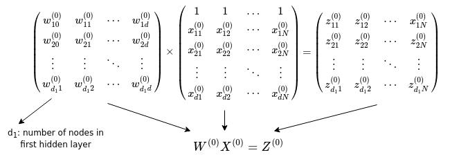

Now that we have described the procedure for calculating the output of a hidden layer connected to the inputs, we can generalise this to an arbitrary number of hidden layers connected to the input layer, by simply repeating the procedure for the number of hidden layers present in the chosen architecture.

Finally, for the output of the neural network we utilise the softmax function, as described below. 

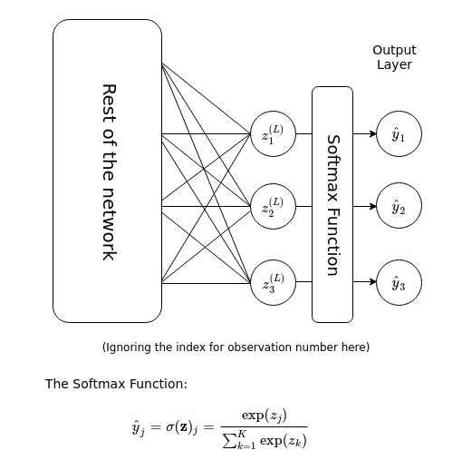

Here, the summation in the denominator is over the $K$ number of categories that the output can possibly belong to. Essentially, the softmax function takes a vector-valued input, exponentiates each component of the vector, then normalises it to produce a a vector-valued output of the same number of components or dimension. The output can then be interpreted as a categorical probability distribution of $K$ different outcomes.

We now have all the ingredients to implement the forward propagation algorithm:


```python
%%add_to Network
def ReLU(self, x):
    """Implementation of Rectified Linear unit for each node."""
    a = np.maximum(np.zeros(np.shape(x)),x)
    return a 

def softmax(self, a):
    """Implementation of Softmax function."""
    a_smax = np.exp(a)
    return a_smax/np.sum(a_smax,axis=0)
        
def fprop(self, x): 
    """Conducts forward propagation and stores node activations in
    an array."""
    self.a = []
    d, N = x.shape        
    x0 = np.insert(x,0,1,axis=0)
    self.a.append(x0)
    # loop through the hidden layers
    for l in range(self.depth):
        a = self.ReLU(np.dot(self.w[l], self.a[-1]))
        self.a.append(np.insert(a,0,1,axis=0))
    # output is produced after passing through the softmax layer
    self.a.append(self.softmax(np.dot(self.w[-1], self.a[-1])))
    return
```

## Cost Functions and Gradient Descent

Now we recall the aim of having utilising an ANN. We want to train an ANN with the appropriate weights so that it can approximate a function which classifies accurately data that we are interested in. In order to measure how far "off" the function $\hat{f}$ represented by the neural network is compared to the function $f$, we will introduce the cost function. The cost function is a measure of how wrong the model is in terms of approximating the actual relationship $f$ between $X$ and $Y$. 

There are two commonly used cost functions. Firstly, the sum of squares error (SSE):

$$SSE = \sum^{N}_{n} (\hat{y}_{n} - y_{n})^{2} = (\hat{Y} - Y)^{T}(\hat{Y} - Y)$$

up to an irrelevant multiplicative constant. Here the sum is over every $n$ observations (of a total of $N$ observations) in the training dataset, and both $\hat{Y}$ and $Y$ are vectors of the form $Y = (y_{1}, y_{2}, \dots, y_{N})^{T}$ where each $y_{n}$ is an integer representing a category. This cost function has a straightforward interpretation of measuring the difference between $\hat{Y}$ and $Y$ directly.

Secondly, the cross entropy:

$$S = - \sum_{n,\alpha} y_{n,\alpha} \log \hat{y}_{n,\alpha}$$

again up to an irrelevant multiplicative constant. Here the sum is over each $n$ observations and $\alpha$ categories. The $y$ and $\hat{y}$ are one hot encoded matrices, such that for a dataset with three categories, a particular observation will have $y$ take on the value of either $(1,0,0)^{T}$, $(0,1,0)^{T}$ or $(0,0,1)^{T}$. The interpretation of this cost function is not as straightforward and would require a primer on information theory. Suffice to say that the cross entropy is just another way of measuring how far off the model is in predicting the target labels of the training set. For the rest of this article, we will select the cross entropy $S$ to be our cost function.

In order to improve our model from one that is initialised with random weights, we would like the minimise the cost function with respect to the weights. One common method of achieving is this is through the process of Gradient Descent. 

Gradient Descent is an iterative algorithm that aims to minimise the cost function with each iteration till convergence. A particular combination of weights throughout the entire neural network can be represented by a point in a multi-dimensional space (as many dimensions as number of weights, or variables to be minimized). The cost function then takes a real-valued number at every point in this space. We want to find the point at which the cost function is the smallest. What gradient descent does is to find the direction in which the cost function decreases the most at the current location in this "weight" space, and then take a small step in this direction in order to decrease the cost function. This is then repeated until the cost function's change compared to the previous iteration is smaller than a threshold.

This direction at which the cost function decreases the fastest is given by the negative of the gradient of the cost function:

$$\nabla S = (\frac{\partial S}{\partial w_{11}}, \frac{\partial S}{\partial w_{12}}, \dots)^{T}$$

Mathematically, taking a small step in this direction is done by the following:

$$w^{n+1}_{ij} = w^{n}_{ij} - \alpha (\nabla S)_{ij}$$

where the $n$ represents the current iteration number. The current set of weights are therefore adjusted in the opposite direction of the gradient, and the parameter $\alpha$, otherwise known as the step size, controls the size of this direction. Having an $\alpha$ that is too small will typically result in slow convergence while having an $\alpha$ that is too large can result in a failure to converge as the algorithm oscillates among points surrounding the minima of the cost function.

In pseudocode, the gradient descent algorithm is as follows:

```
SET vector of weights w to initial value
SET step size alpha
Calculate initial value of cost function S_0
WHILE abs(S_current - S_previous) > threshold
    w = w - alpha* gradient(S_current)
    SET S_current as S_previous
    SET S_current as current calculated cost
```

In order to proceed with the implementation of gradient descent, we thus require the calculation of $\nabla S$, the gradient vector of the cost function. Now there is a naive way to calculate this gradient. Often for functions with few variables, one proceeds to estimate the gradient via the finite difference method (there are many variations of these):

$$\frac{\partial S}{\partial w_{ij}} = \frac{S(\dots,w_{ij}+\epsilon,\dots) - S(\dots,w_{ij}-\epsilon,\dots)}{2\epsilon}$$

This expression looks deceptively simple enough to calculate. However one must note that neural networks may contain hundreds or even thousands or more weights in their architecture. Each calculation of the above equation for each weight requires a single pass of the input through the network twice. Therefore the total number of passes of the input through the network in order to calculate the gradient is double of the total number of weights, while at the same time the complexity of calculating the output through one pass increases with the number of weights. It is clear that this method of obtaining the gradient is very inefficient especially for large networks with a great number of connections (and thus weights).

There is a particular name for the algorithm to more efficiently calculate the gradient of the cost function for neural networks, and it is known as the backpropagation algorithm. Using backprogation allows one to compute the gradient in the same time complexity as calculating the output of the network through forward propagation.

We will include the code for the cost function here:


```python
%%add_to Network
def cost(self, y):
        """Calculates cross-entropy cost. y here is a one-hot encoded matrix
        with columns denoting samples and rows representing class"""
        S = - np.sum(y*np.log(self.a[-1]))
        return S 
```

## The Backpropagation Algorithm

We've seen earlier that in order to train a neural network on a given dataset through gradient descent, we require the gradient of the cost function with respect to the weights and biases to be calculated, i.e. the following quantity:

$$ \frac{\partial S}{\partial w_{ij}} = \, ? $$ 

where $S$ is the cross-entropy cost function and $w_{ij}$ is the weight that connects the j-th node to the i-th node.

To begin with, let us recall the chain rule of calculus. Given a function $f(x) = f(g(x))$, the derivative of $f(x)$ w.r.t. $x$ is then given by:

$$ \frac{df}{dx} = \frac{df}{dg}\frac{dg}{dx}. $$

This is the simplest form of the chain rule, for functions with only a single variable. For functions with two variables, for example $f(x,y) = f(g(x,y), h(x,y))$, we can generalise the above equation as follows:

$$ \frac{\partial f}{\partial x} = \frac{\partial f}{\partial g}\frac{\partial g}{\partial x} + \frac{\partial f}{\partial h}\frac{\partial h}{\partial x} \\
\frac{\partial f}{\partial y} = \frac{\partial f}{\partial g}\frac{\partial g}{\partial y} + \frac{\partial f}{\partial h}\frac{\partial h}{\partial y}$$

with the partial derivatives replacing the total derivatives for multivariate functions. 

The above examples show the chain rule for calculating the derivatives of functions that are composed of out a single layer of functions, for example $f(x) = f(g(x))$. By recursion we can generalise this rule to functions that are composed out of multiple layers of functions, say $f(x) = f(g(h(i(j(x)))))$ and so on. Therefore in general, we have

$$ \frac{\partial f}{\partial x_i} = \sum_{i_1,...,i_n} \frac{\partial f}{\partial y_{i_1}} ... \frac{\partial y_{i_{n-1}}}{\partial y_{i_n}} \frac{\partial y_n}{\partial x_i}. $$

But what does all these mean and how does it relate to neural networks? To make the link clearer, we will revisit the function $f(x,y) = f(g(x,y), h(x,y))$. We can actually represent what this function does in a graphical manner:

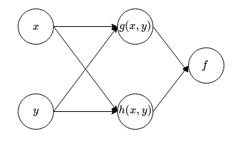

We can also form a graph for calculating the derivatives of this function:

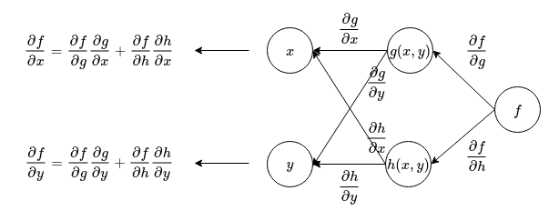

From the above figure, we can see that in order to calculate the derivatives of a composed function, we can first represent the connections between nodes as the derivative of the child node with respect to the parent node. Then, beginning from the node on the right, travel backwards towards the input while multiplying the derivatives on every connection together. The derivative is then obtained by summing up all the accumulated derivatives along every path that leads from output to the input (or whichever variable you are interested in finding the derivative of). This gives a simple rule for calculating derivatives of composed functions.

Now we see in comparison that an ANN is simply a function made of many composed functions. We can also apply a similar principle in order to calculate the derivatives of the cost function with respect to the weights. In order to do this we will represent the ANN with a simpler graph (without loss of generality showing an ANN with only one hidden layer):

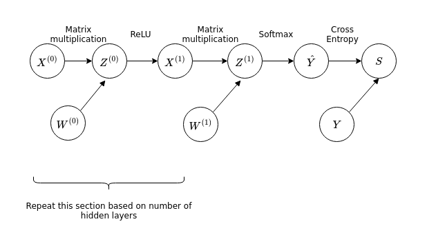

In this discussion we will neglect the biases for simplicity, as the core of the idea is unchanged. Compared to the earlier graphs involving the functions $f$, $g$ and $h$, this graph representing the ANN has matrix valued functions. However we can apply the same principle in order to find the derivatives of the cross entropy with respect to the weights $W^{(i)}$. 

Once again, we start from the output of the function and then work our way backwards along the graph to the inputs. For the weights closest to the output:

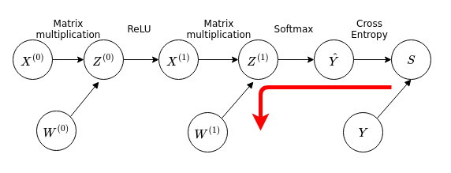

We want to calculate the quantity $\frac{dS}{dW^{(1)}}$, which is a matrix-valued quantity (or vector-valued, since you can use a single index rather than two indices to list all the weights). Working backwards using the chain rule we have in matrix notation:

$$ \frac{dS}{dW^{(1)}} = \frac{dS}{d\hat{Y}} \frac{d\hat{Y}}{d Z^{(1)}} \frac{d Z^{(1)}}{d W^{(1)}}$$

or more explicitly in terms of individual components:

$$ \frac{dS}{dw^{(1)}_{mn}} = \sum_{i} \sum_{jk} \sum_{mn} \frac{dS}{d\hat{y}_{i}} \frac{d\hat{y}_{i}}{d z^{(1)}_{jk}} \frac{d z^{(1)}_{jk}}{d w^{(1)}_{mn}}$$

It turns out to be more convenient to directly calculate $\frac{dS}{d Z^{(1)}} = \frac{dS}{d\hat{Y}} \frac{d\hat{Y}}{d Z^{(1)}}$ instead. These expressions can be evaluated analytically and we can obtain the following expressions in matrix notation:

$$ \frac{dS}{d Z^{(1)}} = \Delta^{(1)} = \hat{Y} - Y \\
\frac{dS}{dW^{(1)}} = \Delta^{(1)} X^{(1)T} $$

Now we move on to the next layer:

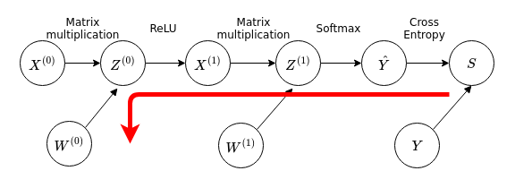

We notice that this path overlaps with the previous path used to calculate $\frac{dS}{dW^{(1)}}$, so we can reuse results from the previous discussion in the calculation of $\frac{dS}{dW^{(1)}}$, for the calculation of $\frac{dS}{dW^{(0)}}$. We have then in matrix notation:

$$\begin{aligned} 
\frac{dS}{dW^{(0)}} &= \frac{dS}{d Z^{(1)}} \frac{d Z^{(1)}}{d X^{(1)}} \frac{d X^{(1)}}{d Z^{(0)}} \frac{d Z^{(0)}}{d W^{(0)}}  \\
&= \Delta^{(1)} \frac{d Z^{(1)}}{d X^{(1)}} \frac{d X^{(1)}}{d Z^{(0)}} \frac{d Z^{(0)}}{d W^{(0)}} 
\end{aligned}$$

From here we can proceed to obtain expressions for each derivative. On point to note is the derivative of the ReLU function. Technically speaking, the ReLU function is not a continuous function - for ReLU$(x)$ its derivative is undefined at $x=0$. We will adopt the following convention for the derivative of the ReLU function:

$$ \frac{d ReLU(x)}{d x} =
\begin{cases} &1  &x > 0\\
&0 &x \leq 0
\end{cases}$$

Adopting such a convention is effectively generalising from gradient descent to *subgradient* descent, however we will not go into the technical details of this choice here. Working through the calculations we obtain the following expressions for the required derivatives:

$$\begin{aligned}
\Delta^{(0)} &= \frac{d S}{d Z^{(0)}} = \Delta^{(1)} \frac{d Z^{(1)}}{d X^{(1)}} \frac{d X^{(1)}}{d Z^{(0)}}\\
(\Delta^{(0)})_{ij} &= \begin{cases}  &(W^{(1)T} \Delta^{(1)})_{ij}  &\text{for  } z^{(0)}_{ij} > 0 \\
&0 &\text{for  } z^{(0)}_{ij} \leq 0 \\
\end{cases}\\
\frac{d S}{d W^{(0)}} &= \Delta^{(0)}X^{(0)T}
\end{aligned}
$$

With these we have the expressions required to calculate the gradient for gradient descent, for an ANN with a single hidden layer. It is easy enough to generalise this for ANNs with an abitrary $L$ number of hidden layers:

$$\begin{aligned}
\Delta^{(L)} &= \hat{Y} - Y \\
\frac{dS}{dW^{(L)}} &= \Delta^{(L)} X^{(L)T} \\
(\Delta^{(L-1)})_{ij} &= \begin{cases}  &(W^{(L)T} \Delta^{(L)})_{ij}  &\text{for  } z^{(L-1)}_{ij} > 0 \\
&0 &\text{for  } z^{(L-1)}_{ij} \leq 0 \\
\end{cases}\\
\frac{d S}{d W^{(L-1)}} &= \Delta^{(L-1)}X^{(L-1)T} \\
(\Delta^{(L-2)})_{ij} &= \begin{cases}  &(W^{(L-1)T} \Delta^{(L-1)})_{ij}  &\text{for  } z^{(L-2)}_{ij} > 0 \\
&0 &\text{for  } z^{(L-2)}_{ij} \leq 0 \\
\end{cases}\\
\frac{d S}{d W^{(L-2)}} &= \Delta^{(L-2)}X^{(L-2)T} \\
&\vdots \\
&\vdots \\
&\vdots \\
(\Delta^{(0)})_{ij} &= \begin{cases}  &(W^{(1)T} \Delta^{(1)})_{ij}  &\text{for  } z^{(0)}_{ij} > 0 \\
&0 &\text{for  } z^{(0)}_{ij} \leq 0 \\
\end{cases}\\
\frac{d S}{d W^{(0)}} &= \Delta^{(0)}X^{(0)T} \\
\end{aligned}
$$

We see that working from the output layer backwards, we can use the derivatives calculated from one layer to calculate the derivatives of the weights connecting the next inner layer. The theory behind backpropagation may seem rather convoluted compared to the naive calculation of the gradient as discussed earlier. However, the computational complexity is in fact much lower in comparison for backpropagation. This is because only one backward pass through the network is required in backpropagation, compared to the large number of forward passes (on the order of the total number of weights) required for the naive method.

One final point to note is that in the previous discussion, we have neglected to discuss the treatment of the derivative of the cost function with respect to the biases. In order to account for the bias weights in the network, we have to make a change to the expression for $\frac{d Z^{(l+1)}}{d X^{(l+1)}}$, when calculating the derivative of the cost function with respect to the weights $W^{(l)}$, ie $\frac{d S}{d W^{(l)}}$. We can proceed by making the observation that the bias nodes (which always have an activation value of one) have no parent node and are always do not have a connection to the previous layer of nodes. In other words, the backpropagation does not 'propagate' the bias weight gradients to the previous layers. More explicitly, the term $\frac{d Z^{(l+1)}}{d X^{(l+1)}}$ has to be restricted to all elements other than bias nodes:

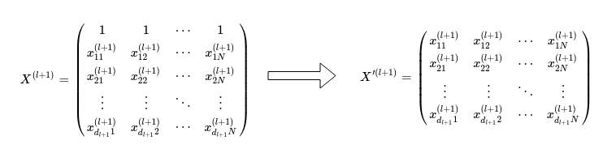

T Here, $d_{l+1}$ is the number of nodes excluding the bias node in the l-th hidden layer. Instead of taking the derivative with respect to $X^{(l+1)}$, we take the derivative $\frac{d Z^{(l+1)}}{d X'^{(l+1)}}$:

$$\begin{aligned}
\Delta^{(l)} &= \frac{d S}{d Z^{(l)}} = \Delta^{(l+1)} \frac{d Z^{(l+1)}}{d X'^{(l+1)}} \frac{d X'^{(l+1)}}{d Z^{(l)}}\\
(\Delta^{(l)})_{ij} &= \begin{cases}  &(W^{(l+1)T} \Delta^{(l+1)})_{ij}  &\text{for  } z^{(l)}_{ij} > 0, i > 0 \\
&0 &\text{for  } z^{(l)}_{ij} \leq 0, i > 0 \\
\end{cases}\\
\frac{d S}{d W^{(l)}} &= \Delta^{(l)}X^{(l)T}
\end{aligned}
$$

neglecting the zeroth row in $X^{(l+1)}$ that contains the bias node activations.

We can now use these expressions in order to implement a backpropagation algorithm:


```python
%%add_to Network
def bprop(self, y):
        """Performs backpropagation. Calculates and stores the Deltas 
        and gradient of the Network within the class attributes:
        - self.Delta
        - self.Grad
        """

        n = len(self.w)
        # initializing lists for Delta and Grad
        self.Delta = [0] * n
        self.Grad = [0] * n
        # number of hidden layers
        L = self.depth
        # This expression below for D_L is specific to the cross entropy cost
        D_L = self.a[-1] - y     
        G_L = np.dot(D_L, self.a[L].transpose())
        self.Delta[-1] = D_L
        self.Grad[-1] = G_L

        for l in range(L, 0, -1):
            pre_D_l = np.dot(self.w[l].transpose(), self.Delta[l])
            D_l = (pre_D_l * (self.a[l] > 0))[1:]  # The first row is neglected
            G_l = np.dot(D_l, self.a[l-1].transpose())
            self.Delta[l-1] = D_l
            self.Grad[l-1] = G_l

        return
    
# Include method in Network Class:
#Network.bprop = types.MethodType(bprop, Network)
```

## Stochastic and Mini-Batch Gradient Descent

There are a few variants of the gradient descent method, and the one that was elaborated upon above is also known as the batch gradient descent method, since it trains the model on the entire batch of training observations. One thing to note about the batch gradient descent algorithm is that it can be inefficient, especially when you are dealing with a huge dataset. Since the cost function is calculated based on the entire training set, each gradient descent update, and in turn the training speed of the model, can become very slow if the training set is very large. Furthermore the gradient descent method requires access to the entire training data stored in memory. Once again, this can be prohibitive if the training dataset is too large. Finally, the cost function for ANNs is in general not a convex function. This results in the batch gradient descent method being liable to converge into local minima rather than global minima.

One method to attempt to overcome some of the issues that batch gradient descent faces is called the stochastic gradient descent. Instead of updating the weights after calculating the cost function over the entire training data, we update the weights after calculating the cost function for every individual sample:

$$w^{n+1}_{ij} = w^{n}_{ij} - \alpha (\nabla S^{(n)})_{ij}$$

where $S^{(n)}$ is the cost function calculated over a single observation. For the cross entropy cost function, this would be given explicitly by:

$$S^{(n)} = - \sum_{\alpha} y_{n,\alpha} \log \hat{y}_{n,\alpha}$$

Once the algorithm iterates over every observation in the training set, the observations are reshuffled and the algorithm repeated. Each cycle of iterations over the training set is known as an *epoch*. In effect, observations are selected randomly and this stochasticity that gives the algorithm its name. It also allows the optimization process to avoid local minima due to the fluctuations induced; the parameters do not necessarily update towards the direction of steepest descent. Of course the fluctuations also cause convergence problems if they are too large; the practical solution is usually to gradually descrease the step size $\alpha$ of each iteration.

The next method, mini-batch gradient descent, is a middle ground between the two extreme examples of batch gradient descent, where the entire training set is used for each update, and stochastic gradient descent, where only a single observation is used for each update. For mini-batch gradient descent, the training set is divided into $m$ number of mini-batches. Each weight update is performed by using the cost function calculated over a mini-batch. So equation used to update the weights is:

$$S^{(i)} = - \sum^{N/m}_{n_{i}} \sum_{\alpha} y_{n_{i},\alpha} \log \hat{y}_{n_{i},\alpha}$$

where $i$ is the mini-batch number, $N$ is the total number of observations, $m$ is the total number of mini-batches and $N/m$ is the number of observations in each mini-batch assuming each mini-batch has the same number of observations. $n_{i}$ labels the observations within the $i$-th mini-batch. In this manner, mini-batch gradient descent tries to take the best of both worlds by:

* Enabling the algorithm to jump out of local minima by sampling randomly arranged data one mini-batch at a time
* Enabling the algorithm to make use of vectorization libraries for better efficiency
* Allowing for smoother convergence compared to SGD since multiple observations in a mini-batch are sampled for each update

Therefore we will use mini-batch gradient descent for our implementation of the ANN. The code for the implementation is given below:


```python
%%add_to Network
def train(self, data, target, eta, epoch, num_batches, threshold):
    """Trains network via mini-batch gradient descent."""
        
    layers = len(self.sizes) - 1
    cost_list = []
        
    # Repeating procedure for each epoch, shuffling the data in the process
    for epoch_no in range(epoch):
            
        index = npr.permutation(data.shape[1])
        shuffled_data = data[:, index]
        shuffled_target = target[:, index]
        batches = np.array_split(shuffled_data, num_batches, axis=1)
        targets = np.array_split(shuffled_target, num_batches, axis=1)
            
        # Updating weights over each mini-batch
        for i in range(num_batches):
                
            self.fprop(data)
            cost_list.append(self.cost(target))
                
            if len(cost_list) > 1:
                if abs(cost_list[-1] - cost_list[-2]) < threshold:
                    print("Gradient descent has successfully converged.")
                    return cost_list
                
            x, y = batches[i], targets[i]
            self.fprop(x)
            self.bprop(y)
                
            for l in range(layers):
                # Gradient Descent
                self.w[l] = self.w[l] - eta * self.Grad[l]
                
            print("Epoch number: {}. Mini-batch number:{}".
                    format(epoch_no, i))
        
    print("Gradient descent has failed to converge.")
    
    return cost_list

# Include method in Network Class:
#Network.train = types.MethodType(train, Network)
```

## Gradient Checking

In order to ensure that our implementation of backpropagation calculated the correct gradient, it is important to be able to check the result of backpropagation calculation. Even with small bugs in the algorithm, it is still possible to train the neural network in a less-than-ideal manner and produce reasonable looking but non-optimal results. In this section, we therefore describe the implementation of a numerical gradient checker to check for any bugs in our backpropagation algorithm and to ensure that everything is working correctly. Earlier we introduced the following numerical approximation for the gradient:

$$\frac{\partial S}{\partial w_{ij}} = \frac{S(\dots,w_{ij}+\epsilon,\dots) - S(\dots,w_{ij}-\epsilon,\dots)}{2\epsilon}$$

The implementation of this numerical approximation is fairly straightforward, albeit inefficient for large networks. We will therefore check the gradient on a smaller network instead. This is done by looping over every layer and within each layer to individually calculate the gradient with respect to each weight. The gradients are arranged in an array and then compared with the gradient obtained from backpropagation:


```python
def gradcheck(x, y, N, sizes, eps, threshold=0.001):
    """Function to perform gradient checking."""

    w = copy.deepcopy(N.w)
    L = len(w)
    gapprox = [0] * L

    for l in range(L):
        gapprox[l] = np.zeros_like(w[l])

    # Numerical approximation of gradient    
    for l in range(L):
        a, b = np.shape(w[l])
        for i in range(a):
            for j in range(b):
                M = Network(sizes)
                P = Network(sizes)
                M.w = copy.deepcopy(w)
                P.w = copy.deepcopy(w)
                M.w[l][i,j] += eps
                P.w[l][i,j] -= eps
                M.fprop(x)
                P.fprop(x)
                gapprox[l][i,j] = (M.cost(y) - P.cost(y)) / (2*eps)

    # Compare the numerical approximation with the value obtained from backpropagation.
    # If the difference is larger than a specified threshold, return false.
    # Otherwise return true as feedback that the implementation is correct.
    for l in range(L):
        diff = np.abs(N.Grad[l] - gapprox[l])
        if np.sum(diff > threshold) == True:
            print('Gradient Error.')
            return 

    print('Gradient implementation successful.')
    return 
```


```python
# Create dataset
X, Y = make_gaussian_quantiles(n_samples=30, n_features=2, n_classes=3)
data = np.transpose(X)
encoder = OneHotEncoder(sparse=False)
Y_encoded = encoder.fit_transform(Y.reshape(-1,1))
target = np.transpose(Y_encoded)

# Initialise small network
sizes = [2,3,3]
N = Network(sizes)

# Forward and backward propagate to obtain gradient
N.fprop(data)
N.bprop(target)

# Check gradient with gradcheck function
gradcheck(data, target, N, sizes, eps=0.0001)
```

    Gradient implementation successful.


The gradient checking function verifies that our implementation of backpropagation returns the correct gradient, and that no errors in implementation are present.
